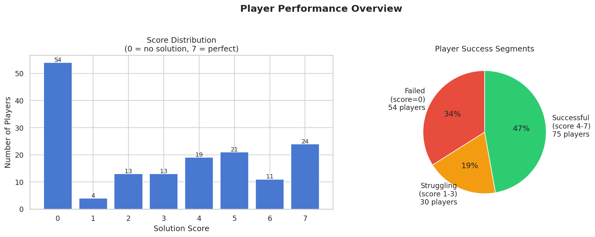
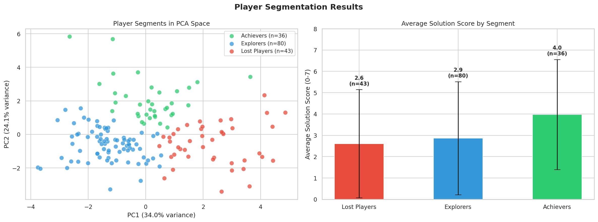
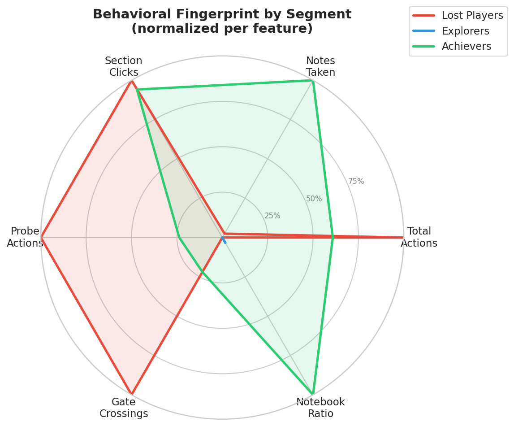
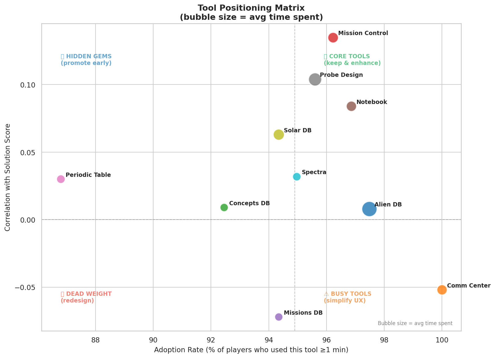

# 🚀 Alien Rescue — Game Analytics

**Behavioral analysis of 159 players · 85,194 log events · 1-hour gameplay session**

> *Analyzing player behavior from a game studio perspective to uncover what drives success,  
> why players fail, and how the game can be improved.*

---



---

## 🎯 Business Questions Answered

| # | Question | Method |
|---|---|---|
| 1 | How are players performing overall? | Distribution analysis |
| 2 | Are there distinct player types? | K-Means clustering (k=3) |
| 3 | Can we detect struggling players early? | Random Forest + Risk Score |
| 4 | Which tools are used most — and do they help? | Adoption & correlation |
| 5 | Which tools need redesign? | Tool Positioning Matrix |
| 6 | How do players navigate between tools? | Transition matrix |

---

## 📊 Key Findings

### 1 — Player Segmentation

K-Means clustering revealed **3 distinct player types** based purely on in-game behavior:



| Segment | Count | Avg Score | Signature |
|---|---|---|---|
| 🟢 Achievers | 36 | **3.97** | 2× more notes · 16% time in Notebook · systematic |
| 🔵 Explorers | 80 | 2.86 | Largest group · lowest activity · passive |
| 🔴 Lost Players | 43 | 2.60 | Most actions (748 avg!) but scattered, no direction |

**Key insight:** Lost Players generate the most clicks but score the lowest.  
Activity volume ≠ strategic engagement.

---

### 2 — Behavioral Fingerprints



---

### 3 — Tool Positioning Matrix

Each tool evaluated by adoption rate (how many players used it) and value (correlation with success):



| Category | Tools | Recommendation |
|---|---|---|
| ⭐ Core | Mission Control, Probe Design, Notebook | Protect & surface early |
| 💎 Hidden Gem | Solar DB, Periodic Table, Concepts DB | Add to onboarding |
| ⚠️ Busy | Comm Center | 100% adoption, negative correlation — simplify |
| 🔴 Dead Weight | Missions DB | Negative correlation — redesign |

---

## 📁 Project Structure

```
alien-rescue-analytics/
├── data/
│   ├── Log_Raw.csv                    # 85,194 raw in-game events
│   ├── Consoles.csv                   # Tool open/close events
│   ├── Gates.csv                      # Zone transition events
│   └── Duration_Charateristics.csv    # Player profiles & scores
├── notebooks/
│   └── alien_rescue_analysis.ipynb   # ← Full analysis (start here)
├── outputs/
│   └── figures/                       # 14 generated charts
├── presentation.pdf                   # Executive summary (11 pages)
└── README.md
```
---

## 🛠️ Tech Stack

`Python 3` · `pandas` · `numpy` · `matplotlib` · `seaborn` · `scikit-learn`

---

## 📚 Dataset

**Source:** Liu, S. & Liu, M. (2019). *Data on player activity and characteristics in a Serious Game Environment.*  
Data in Brief. DOI: [10.1016/j.dib.2019.104965](https://doi.org/10.1016/j.dib.2019.104965)

*Collected at University of Texas at Austin, Alien Rescue Research Team.*
